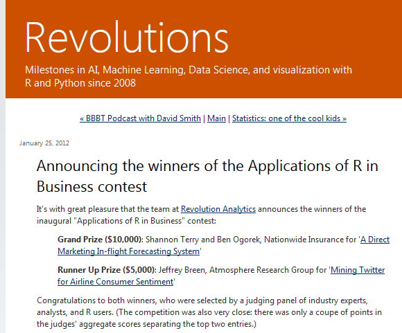
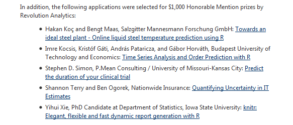
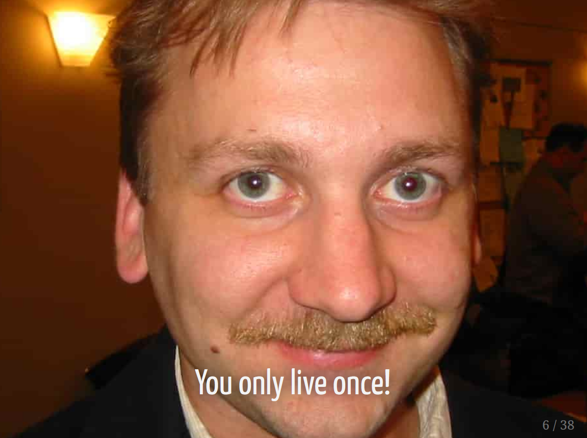
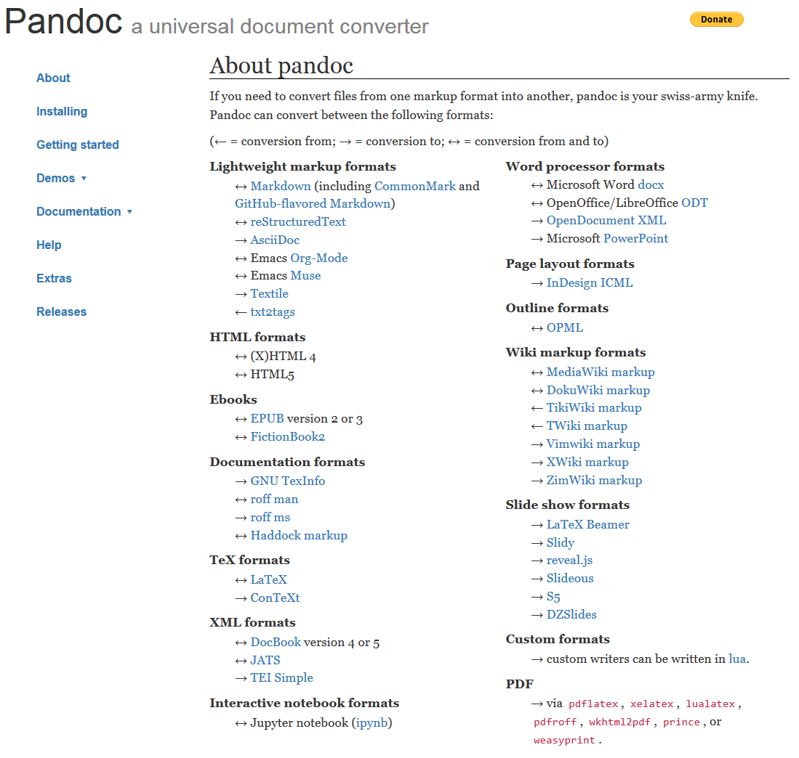
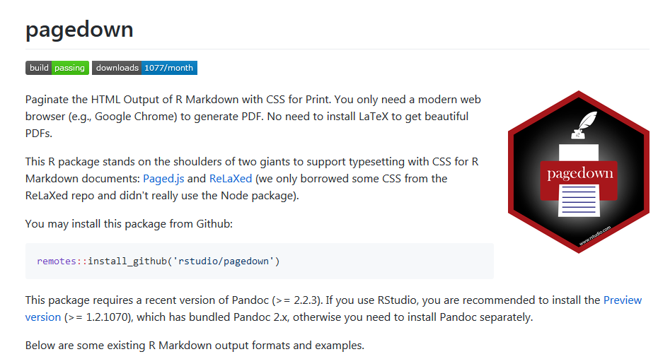
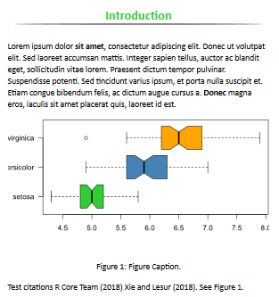
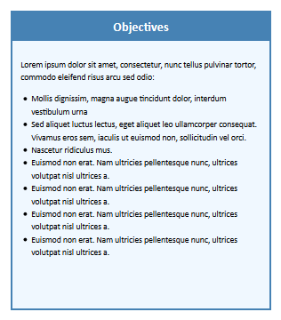
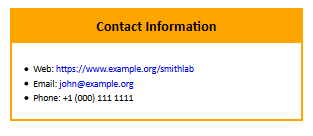
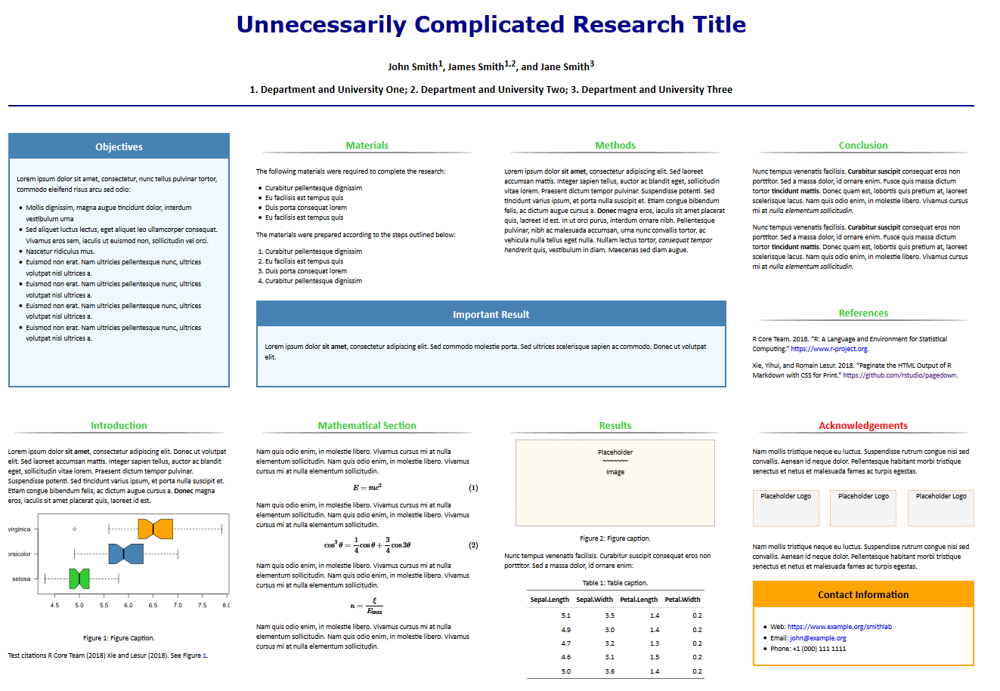
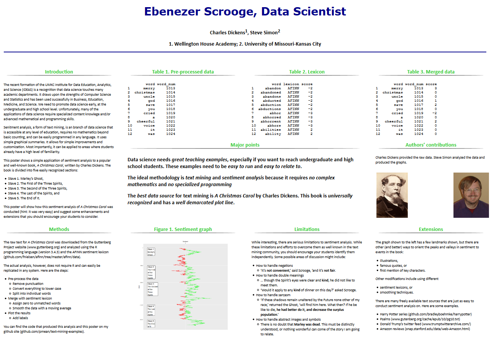

### Hall of Fame for R ( 1 of 2)

+ John Chambers
  + Becker, Chambers and Wilks, The New S Language: A Programming Environment for Statistical Analysis and Graphics (1988)
  + Chambers and Hastie (Eds), Statistical Models in S (1992) 
+ Ross Ihaka and Robert Gentleman
  + R: A language for data analysis and graphics.  Journal of Computational and Graphical Statistics, 5(3):299-314, 1996. Available in [PDF format](https://www.stat.auckland.ac.nz/~ihaka/downloads/R-paper.pdf)

### Hall of Fame for R (2 of 2)

+ William Venables and Brian Ripley
  + Modern Applied Statistics with S
+ Frank Harrell
  + Hmisc, rms packages
+ Hadley Wickham
  + tidyverse packages

### Hall of Fame for R, latest addition (1 of 2)
+ Yihui Xie
  + **animation**: a gallery of animations in statistics and utilities to create animations, **blogdown**: create blogs and websites with R Markdown, **bookdown**: author books and technical documents with R Markdown, **DT**: a wrapper of the JavaScript library DataTables, **formatR**: Format R code automatically, **knitr**: Dynamic report generation with R, **printr**: Some printing methods for knitr, **Rd2roxygen**: Convert Rd to roxygen documentation
  
### Hall of Fame for R, latest addition (2 of 2)
+ Yihui Xie
  + **rlp**: Write an R package using literate programming techniques, **servr**: a simple HTTP server to serve static files or dynamic documents, **testit**: a simple package for testing R packages, **tinytex**: a lightweight LaTeX distribution based on TeX Live, **tufte**: Tufte styles for R Markdown documents, **xaringan**: presentation ninja, **xfun**: miscellaneous functions

### One degree of separation (1 of 2)



### One degree of separation (2 of 2)



### Strange fact about Yihui Xie



### knitr, Yihui Xie's major contributions to R
+ Successor to sweave
+ Integrates program code, output, and documentation
+ Uses plain text files
  
### Pandoc is the foundation



### Markdown is the machinery
+ Simplified version of markup (html, LaTeX)
  + Smaller feature set
  + Readable input
  + Easy to learn
+ Similar in spirit to yaml

### What can you create?
+ Web pages
  + Blog site
+ PDF documents
  + Books
+ Presentations
  + Powerpoint
  + html presentations (ioslides, slidy)
  + PDF presentations (Beamer)
  
### Pagedown



### Features not found in knitr

+ Paged html files
+ Cascading Style Sheets (CSS)
+ Bypasses LaTeX
  + “The most challenging thing in the world is not to learn fancy technologies, but control your own wild heart.” Yihui Xie, as quoted in Appendix C of Authoring Books wtih R Markdown.

### CSS formats included in pagedown
+ Resume
+ Business card
+ Business letter
+ Various journal templates
+ Poster
  + ReLaXed
  + poster-jacobs
  
### Pagedown requirements
+ Pandoc version 2
  + Install yourself, or update to Rstudio 1.2
+ File | New File | R Markdown | From Template

### Other features in RStudio 1.2
+ Background runs
+ Better C++, D3, Python, SQL, Stan integration
+ Build Powerpoint presentations
+ Custom chunk engines
+ Detect missing packages
+ Visit [RStudio blog](https://blog.rstudio.com/categories/rstudio-ide) for more information.

### poster-jacobs.css
  
```{}  
@page {
  size: 46.8in 33.1in;
  margin: 0;
}
* {
  box-sizing: border-box;
}
html {
  width: 46.8in;
  height: 33.09in;
}
```

### poster-jacobs.css

```{}
body {
  margin: 0;
  font-size: 32px;
  width: 100%;
  height: 99.9%;
  grid-gap: 1.2in;
  padding: 1.2in;
  font-family: Optima, Calibri, sans-serif;
}
```

### poster-jacobs.css

```{}
body {
  display: grid;
  grid-template-areas:
    'S1 S1 S1 S1'
    'S2 S4 S5 S9'
    'S2 S4 S5 S9'
    'S2 S4 S5 S9'
    'S2 S6 S6 S10'
    'S3 S7 S8 S11'
    'S3 S7 S8 S11'
    'S3 S7 S8 S11'
    'S3 S7 S8 S12'
    'S3 S7 S8 S12';
  grid-template-columns: repeat(4, 1fr);
  grid-template-rows: repeat(10, 1fr);
}
```

### poster-jacobs.css

```{}
.section-1 { grid-area: S1; }
.section-2 { grid-area: S2; }
.section-3 { grid-area: S3; }
.section-4 { grid-area: S4; }
.section-5 { grid-area: S5; }
.section-6 { grid-area: S6; }
.section-7 { grid-area: S7; }
.section-8 { grid-area: S8; }
.section-9 { grid-area: S9; }
.section-10 { grid-area: S10; }
.section-11 { grid-area: S11; }
.section-12 { grid-area: S12; }

```

### poster-jacobs.Rmd, yaml header (1 of 4)

```{}
---
title: "Unnecessarily Complicated Research Title"
author: "John Smith^1^, James Smith^1,2^, and Jane Smith^3^"
institute: "1. Department and University One; 2. Department and University Two; 3. Department and University Three"
date: "2018-11-30"
```

### poster-jacobs.Rmd, yaml header (2 of 4)

```{}
references:
  - id: R-base
    author:
    - family: "R Core Team"
      given: ""
    title: 'R: A Language and Environment for Statistical Computing'
    issued:
      year: 2018
    URL: https://www.r-project.org
```

### poster-jacobs.Rmd, yaml header (3 of 4)

```{}
  - id: R-pagedown
    author:
    - family: Xie
      given: Yihui
    - family: Lesur
      given: Romain
    title: 'Paginate the HTML Output of R Markdown with CSS for Print'
    issued:
      year: 2018
    URL: https://github.com/rstudio/pagedown
```

### poster-jacobs.Rmd, yaml header (4 of 4)

```{}
output:
  pagedown::poster_jacobs:
    self_contained: false
    pandoc_args: --mathjax
---

```

### poster-jacobs.Rmd, default h1

```{}
Introduction
================================================================================

Lorem ipsum dolor **sit amet**, consectetur adipiscing elit. Donec ut volutpat elit. Sed laoreet accumsan mattis. Integer sapien tellus, auctor ac blandit eget, sollicitudin vitae lorem. Praesent dictum tempor pulvinar. Suspendisse potenti. Sed tincidunt varius ipsum, et porta nulla suscipit et. Etiam congue bibendum felis, ac dictum augue cursus a. **Donec** magna eros, iaculis sit amet placerat quis, laoreet id est.
```

### poster-jacobs.css, default h1

```{}
h1 {
  color: limegreen;
  margin: 0;
  padding: .5em;
  font-size: 1.5em;
}

h1 hr {
  border: 6px solid gray;
  clip-path: ellipse(50% 3px at center);
  margin: 0;
}
```

### poster-jacobs.html, default h1



### poster-jacobs.Rmd, block

```{}
Objectives {.block}
================================================================================

Lorem ipsum dolor sit amet, consectetur, nunc tellus pulvinar tortor, commodo eleifend risus arcu sed odio:

- Mollis dignissim, magna augue tincidunt dolor, interdum vestibulum urna
- Sed aliquet luctus lectus, eget aliquet leo ullamcorper consequat. Vivamus eros sem, iaculis ut euismod non, sollicitudin vel orci.
```

### poster-jacobs.css, block

```{}
.block {
  border: .1in solid steelblue;
  background-color: aliceblue;
}

.block h1 {
  background-color: steelblue;
  color: white;
}

.block > .content {
  padding: 1em;
  line-height: 1.5em;
}

```

### poster-jacobs.html, block



### poster-jacobs.Rmd, orange highlight

```{}
Contact Information {.block data-color=black data-border-color=orange data-background-color=white}
================================================================================

- Web: https://www.example.org/smithlab
- Email: john@example.org
- Phone: +1 (000) 111 1111

```

### poster-jacobs.html, orange highlight



### poster-jacobs.html, entire poster



### My poster



### Some hints

+ This is NOT a WYSIWYG approach
+ Size of image files is important
  + Pagedown will NOT resize to fit
+ Text can overflow boundaries
  + Easier to modify the text than the CSS file
  
### Why I like pagedown for posters

+ I hate Powerpoint
  + Proprietary
  + Binary format
+ Focus on content independent of layout
+ Integrates easily with git
+ Easy to include complex formulas
